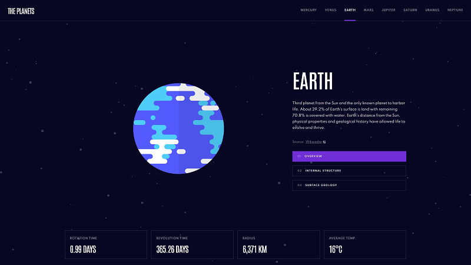
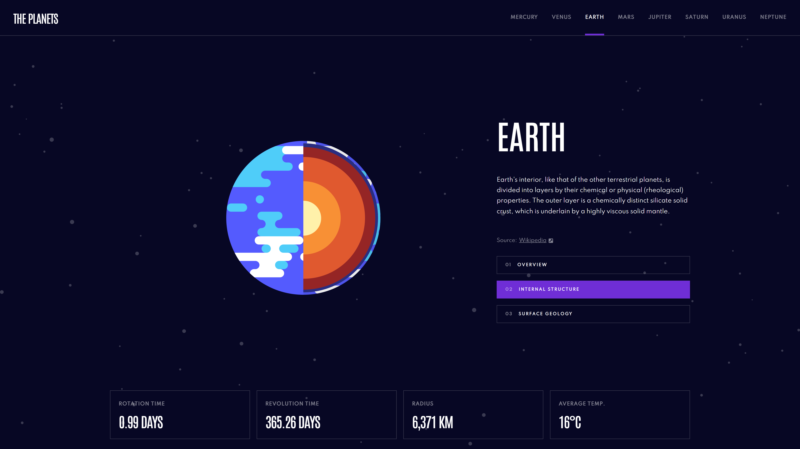
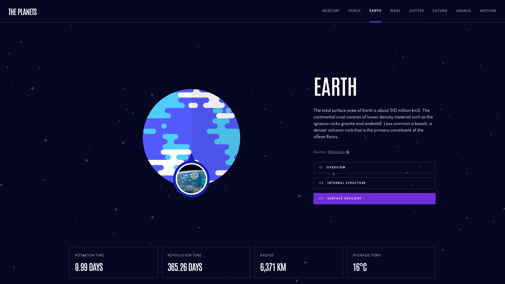

[]

[]

[]

<h2 align="left">Planets fact - the application contains the most important information about each planet of the solar system</h4>
<h3 align='left'>About project 🔍</h3> 

Solution of frontend mentor challenge. The application generates information about planet given from the API. Every single planet have special color for active link, button and loading spinner.

💻 Link to the challenge: https://www.frontendmentor.io/challenges/planets-fact-site-gazqN8w_f

<h2 align='left'>Technologies used 💎</h2> 

React 🔹 Typescript 🔹 Styled components

